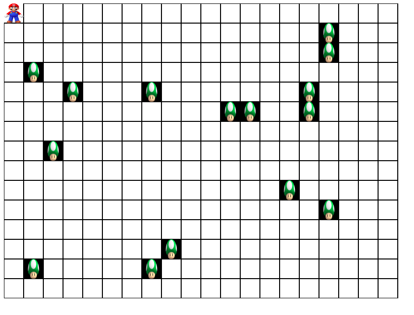

PROBLEM STATEMENT:

Mario is very hungry and wants to eat mushrooms but they are randomly hidden in a grid of
MxN where M is number of rows and N is number of columns. Mario will always start its hunt
for mushrooms from 0th cell,i.e (0,0). To help Mario move you have to use the arrow keys to
reach a particular mushroom. Mario tummy will be filled only after he has eaten all the
mushrooms in the grid.

Input:

1. A Prompt asking for M number of rows
2. Another Prompt asking for N number of rows

Output:

No of cells travelled by Mario to eat all the mushrooms

